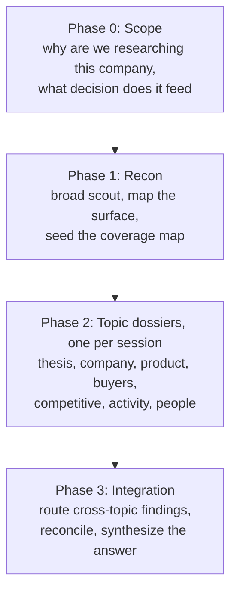

# Company Research Pipeline

A repeatable pipeline for researching a company to diligence depth, built for [Claude Code](https://claude.com/claude-code) with two research tools: [Exa](https://exa.ai) (neural web search and crawling) and [Apify](https://apify.com) (LinkedIn and X/Twitter, the sources Exa cannot reach).

The output is a set of seven **dossiers**: cited, confidence-tagged reference documents that together answer every question that matters about a company. Every fact carries a source. Every judgment is labeled as fact, inference, or assumption, with a confidence percentage. Conflicts between sources are surfaced, never silently resolved.

This is not a prompt collection. It is a distillation of a real engagement: seven verified dossiers on a venture-backed AI infrastructure company, built from 300+ sources, with every load-bearing claim checked against primary records (regulator filings, package registries, live product documentation, official appointment rosters). The method survived adversarial review. The failures it guards against (stale caches, name collisions, marketing claims dressed as shipped product, single-source figures) were all hit in practice.

## What you need

1. **Claude Code** (CLI or desktop).
2. **Exa MCP server** connected. Carries the bulk of the research.
3. **Apify MCP server** connected (optional, but required for LinkedIn/X coverage).

## Quick start

```bash
git clone https://github.com/thangnguyenworkspace/company-research-pipeline.git
cd company-research-pipeline
claude
```

Then, inside Claude Code:

```
/research-company Acme Corp
```

That command scopes the engagement, runs recon, sets up a working folder under `research/acme-corp/`, and walks you through the seven topic dossiers one at a time. Expect one focused session per dossier. You can also run any single piece directly:

| Command | What it does |
|---|---|
| `/research-company <name>` | Orchestrates the whole pipeline for one company |
| `/research-topic <topic>` | Runs one dossier through gather, verify, attack, write |
| `/exa-crawl <url>` | Crawls one page or PDF with the tuned parameters and fallback |
| `/social-crawl <urls or handles>` | Pulls LinkedIn posts or X posts via Apify |
| `/repo-recon <owner/repo>` | Explores a GitHub repository, scan first then dive |

## The pipeline at a glance



Each topic dossier runs the same eight-step loop: **load context, gather, compile, verify, attack, supplement, write, distribute**. The full method is in the playbook.

## Repository layout

| Path | Contents |
|---|---|
| `playbook/01-pipeline.md` | The macro arc and the eight-step topic pipeline |
| `playbook/02-epistemics.md` | The tagging and source-grading system that keeps you honest |
| `playbook/03-topics.md` | The seven dossier subjects, what each owns, and the build order |
| `playbook/04-tools.md` | Verified Exa and Apify usage rules, including the cost traps |
| `.claude/commands/` | The five skills, live as slash commands when you open Claude Code here |
| `templates/` | Skeletons for dossiers, gather reports, verification reports, coverage maps |
| `research/` | Your working folders land here, one per company |

## The three rules that carry the whole system

1. **No fact without a citation.** Every claim carries an in-text link that resolves to an openable source, and every dossier ends with a reference list. If you cannot trace a claim, it is labeled unverified and treated accordingly.
2. **Tag every judgment.** `[F/90%]` means a fact checked against a primary source at 90% confidence. `[I/75%]` means your inference. `[A/50%]` means an assumption that must hold for the read to stand. The tag forces you to know which one you are making.
3. **Verify adversarially.** The verification step tries to refute claims, not confirm them. Marketing pages are evidence of what a company markets; what ships is a separate, harder question. When two sources disagree, both numbers and both sources go in the dossier.

## License

MIT. Use it, fork it, adapt it.
