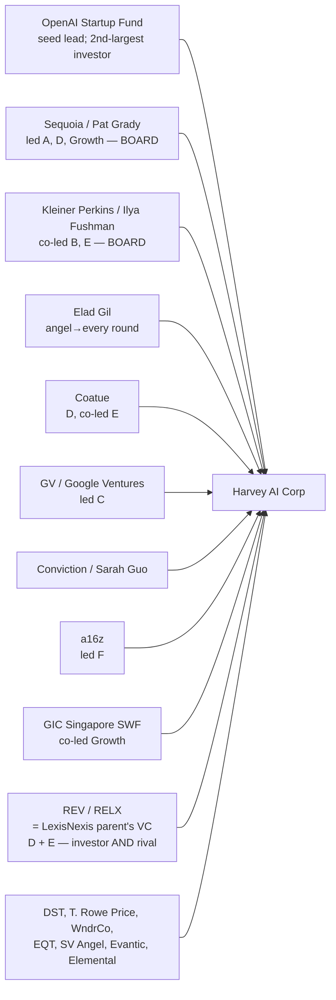

# Dossier, Company

## Owns (single source of truth)

This dossier owns **facts about the entity**: legal identity and corporate structure, founding and history, the founders' verified pre-history, the funding ladder and cap-table/governance, the investor orbit, and the reported traction metrics (revenue, customers, users, headcount, footprint).

**Does NOT own:** whether the bet is sound and the moat holds (dossier-thesis); what ships vs. what is marketed, and the tech stack (dossier-product); who buys and why, ICPs and market sizing (dossier-buyers); the competitor market map and the REV/LexisNexis rivalry analysis (dossier-competitive — this dossier owns only the *fact* that REV invested); the timeline-as-momentum read and forecast (dossier-activity — this dossier owns the dated events, activity owns the temporal interpretation); founders'/leaders' roles as people-signal, hiring and org design (dossier-people). The *timing read* of any round ("four raises in 12 months signals X") is owned by dossier-activity; this dossier owns the rounds themselves.

## How to read the tags

Every load-bearing claim carries `[X/NN%]`: **F** = fact (checked against a primary source), **I** = inference, **A** = assumption. NN% is our confidence. **Traction caveat (applies dossier-wide):** essentially every revenue/customer/user/agent figure originates with Harvey (blog posts, press releases, CEO interviews) and is unaudited. These carry split tags: high confidence *that Harvey states it*, lower confidence *that it is independently true*. Conflicts are surfaced inline. Every fact resolves to the Reference List.

---

## 1. Identity & legal structure

> Purpose: pin the entity precisely, from the primary corporate record.

**1.1 Legal entity.** **Harvey AI Corp**, formerly **Counsel AI Corp** — confirmed from SEC EDGAR (registrant CIK 0001974654, `formerNames: ["Counsel AI Corp"]`) [F/98%] (SEC EDGAR, fetched 2026-07-04). Incorporated in **Delaware**, **year 2022** [F/95%] (SEC Form D). HQ: **201 Third Street, Suite 500, San Francisco, CA 94103** [F/96%] (SEC business address). Two USPTO "HARVEY" trademarks (serials 97690544, class 042 SaaS; 97690542, legal information services) owned by "Counsel AI Corporation," both filed 2022-11-23 [F/90%] (USPTO via Justia).

**1.2 The name.** "Harvey" is named after **Harvey Specter**, the lead character of the legal drama *Suits* [F/85%] (Wikipedia; corroborated Forbes AU) — a detail that later became a marketing asset (Harvey signed *Suits* actor Gabriel Macht in 2026; see dossier-activity). The corporate rename Counsel AI → Harvey is the only rename found; there was no public product rebrand.

**1.3 Naming hygiene note.** SEC uses "Harvey AI Corp"; USPTO owner-of-record is "Counsel AI Corporation"; press and this engagement use "Harvey." A separate SEC entity, "General Counsel AI, Inc." (CIK 0002036281), is **not** Harvey and was excluded during gather [F/90%].

## 2. Founding & history

> Purpose: the verifiable facts of how Harvey began and the milestones that set its trajectory.

**2.1 Founders.** **Winston Weinberg** (co-founder, CEO) — a first-year litigation associate at **O'Melveny & Myers** (LA office; securities/antitrust; USC Gould law) [F/90% on O'Melveny; F/70% USC Gould, single-source]. **Gabriel (Gabe) Pereyra** (co-founder, President) — research scientist at **Google DeepMind / Google Brain**, then ML engineer at **Meta AI (FAIR)**; USC CS background [F/88%]. Both are listed as Executive Officer + Director on Harvey's SEC filings [F/95%] (SEC Form D). *Their significance as people/leaders is owned by dossier-people; here they are entity facts.*

**2.2 The origin, as consistently told.** Pereyra showed Weinberg GPT-3 in late 2021; they built a chain-of-thought prompt over California landlord-tenant statutes and ran a blind test — **"on 86 of 100 samples, two of three attorneys said they'd send it with zero edits"** [F/85% that this is the account; I/60% that it is a rigorous result — self-reported PoC] (TechCrunch; corroborated Wikipedia, FT). They **cold-emailed Sam Altman and Jason Kwon** (OpenAI GC), pitched OpenAI's C-suite on **July 4, 2022**, and the **OpenAI Startup Fund became the seed investor** with early GPT-4 access [F/88%] (TechCrunch; Wikipedia). *The strategic why-now reading of this is owned by dossier-thesis.*

**2.3 Founding-city conflict (surfaced).** CONFLICT: the **incorporated HQ is San Francisco** (SEC, primary) [F/95%], but the pre-incorporation roommate apartment is variously placed in **San Francisco** (TechCrunch), **San Diego** (Forbes AU, which self-contradicts), and **Los Angeles** (Wikipedia; Weinberg's O'Melveny job was LA) — carried, not resolved. Only the corporate HQ (SF) is a fact; the origin-apartment city is disputed color.

**2.4 Milestone timeline (dated events; momentum read owned by dossier-activity).**

| Date | Event | Source grade |
|---|---|---|
| Nov 2022 | Seed emerges from stealth; Allen & Overy begins trialing Harvey (MIG) | [F/90%] |
| Feb 15, 2023 | **A&O exclusive launch partnership** — firmwide to 3,500+ lawyers across 43 offices (first major enterprise customer) | [F/92%] (A&O primary) |
| Mar 15, 2023 | **PwC global alliance** — exclusive among the Big Four; 4,000 legal professionals across 100+ countries | [F/92%] (PwC primary) |
| 2023 | "Lighthouse" firm co-development program (sole-namer Forbes AU) | [F/60%] |
| May 2024 | Commercial GA; products on Microsoft Azure; Vault for large document sets | [F/80%] |
| Sep 2025 | Sydney office (APAC HQ) opens; Toronto (Oct 2025); Milan team | [F/85%] |
| Jun 2, 2026 | Singapore office opens (joins Bengaluru, Sydney in APAC) | [F/88%] (Harvey primary) |

**2.5 Footprint.** Global HQ San Francisco; largest offices SF, New York, London [F/85%]; APAC (Sydney HQ, Singapore, Bengaluru); Europe (London, Milan, Spain, Germany); Toronto. Self-stated reach **60+ countries** [F/85% claimed] (harvey.ai/company). Aggregator-listed "Newport Beach" and "Amsterdam" offices are uncorroborated and flagged unreliable [I/30%].

## 3. The funding ladder

> Purpose: the complete, primary-sourced capital history. Round-level facts are solid; the single "total raised" is a surfaced conflict.

| # | Round | Announced | Amount | Post-val | Lead(s) | Confidence |
|---|---|---|---|---|---|---|
| 1 | Seed | Nov 2022 | $5M | undisclosed | OpenAI Startup Fund (+ angels Jeff Dean, Elad Gil, Sarah Guo) | [F/90%] |
| 2 | Series A | Apr 2023 | $21M (Form D ~$25.8M) | undisclosed | Sequoia (Pat Grady) | [F/88%; amount CONFLICT] |
| 3 | Series B | Dec 2023 | $80M | $715M | Elad Gil + Kleiner Perkins | [F/92%] |
| 4 | Series C | Jul 2024 | $100M | $1.5B | GV (Google Ventures) | [F/92%] |
| 5 | Series D | Feb 2025 | $300M | $3B | Sequoia (+ Coatue, **REV/LexisNexis**) | [F/92%] |
| 6 | Series E | Jun 2025 | $300M | $5B | Kleiner Perkins + Coatue | [F/90%; val CONFLICT vs MVP $9.2B] |
| 7 | EQT Growth | ~Oct 2025 | €50M (~$58.7M) | — | EQT Growth | [F/70%; press/aggregator only] |
| 8 | Series F | Dec 2025 | $160M | $8B | Andreessen Horowitz | [F/90%] |
| 9 | Growth | Mar 2026 | $200M ($200,009,773 per Form D) | $11B | GIC + Sequoia | [F/95%] |

**3.1 Total raised — CONFLICT carried.** Reported totals span **$988M (MVP) → "over $1B"/"$1.2B+" (Harvey/CNBC/Sequoia, Dealroom) → $1.19B (PitchBook) → $1.22B (Tracxn) → $1.3B (StartupIntros)**. The mechanical sum of announced headline amounts ≈ **$1.22B**. Most defensible statement: **"over $1.2B across ~9 rounds"** [F/85%]; the exact total is not externally verifiable and is carried as a conflict.

**3.2 Surfaced round conflicts (carried).** Series A: $21M headline (Harvey/Sequoia) vs ~$25.8–25.9M (SEC Form D / PitchBook). Series E valuation: $5B (Harvey primary) vs $9.2–9.3B pre/post (Manhattan Venture Partners — anomalous, likely a data error). Growth round labeled "Series G" by Tracxn, "Growth" by Harvey. All carried, not resolved.

**3.3 The cadence.** Four rounds in ~12 months (Series E Jun 2025 → EQT Oct → Series F Dec → Growth Mar 2026), Series D→E→F→Growth taking the valuation $3B→$5B→$8B→$11B in ~13 months [F/90%]. *The momentum interpretation of this cadence is owned by dossier-activity; the valuation-vs-fundamentals skepticism (~58x ARR) is carried in dossier-thesis §6.6.*

## 4. Ownership, governance & the investor orbit (analytical spine)

> Purpose: map who backs and who controls Harvey — the investor-orbit map.

**4.1 Board & control (SEC-primary).** Directors: **Winston Weinberg**, **Gabriel Pereyra**, **Pat Grady** (Sequoia, seated since Series A Apr 2023), **Ilya Fushman** (Kleiner Perkins, since Series B Dec 2023), **John LaBarre** [F/94%] (SEC Form D 2026-04-06). Additional executive officers (non-director): **Alan Ghelberg** (CFO), **Katie Burke** [F/90%]. Read: a **founder-controlled board** seating only the two earliest institutional leads; the co-founders hold both officer and director roles → concentrated founder control [I/80%]. No independent outside chair is disclosed.

**4.2 The recurring orbit.**

**4.3 The notable orbit facts.** **Sequoia led three rounds** (A, D, Growth) — "rare for Sequoia" (Pat Grady) [F/88%]. The **OpenAI Startup Fund** was the first institutional investor and, per Weinberg, "the second-largest investor" [F/85%]. **REV Venture Partners** — confirmed from Harvey's own Series D/E blogs as "the venture capital arm of RELX Group which owns LexisNexis Legal & Professional" — invested in D and E, making **LexisNexis simultaneously a Harvey investor and a direct competitor** [F/92%] (Harvey primary). *The competitive implications of that dual role are owned by dossier-competitive; the fact of the investment is owned here.*

**4.4 Liquidity.** Harvey's **first tender offer** (employee liquidity) was completed as part of the a16z-led Series F (Dec 2025) [F/90%] (Harvey primary). No debt or M&A reported; growth has been all-organic + venture [F/80%].

## 5. Traction (all company-reported / unaudited)

> Purpose: the reported scale, each figure tagged for "claimed" vs "audited-true." **Read every number here through the traction caveat.**

**5.1 Revenue / ARR trajectory.** ~$0 (2022) → ~$10M ARR (end 2023) → "4x ARR growth" in 2024 (Harvey) / $65.8M (GetLatka independent estimate — CONFLICT) → **$100M ARR (Aug 2025)** → **$190M ARR (Jan 2026)** [F/88% that Harvey/Weinberg state $190M; I/60% audited-true] (CNBC; TechCrunch reporting Weinberg's LinkedIn). The $100M→$190M jump in ~5 months is a genuine near-doubling *as claimed* [F/85% claimed]. *(Backflow from dossier-people social-crawl, 2026-07-04):* Weinberg posted on LinkedIn (Jul 1 2026) that Harvey "just closed our first **$100M+ net-new-ARR quarter**" — which, on top of the $190M Jan-2026 base, makes the previously-uncorroborated **~$300M ARR (mid-2026)** figure now **credible** [F/78% that Weinberg claims a $100M+ net-new quarter; I/60% that ARR is ~$300M]. Still Harvey-self-reported/unaudited.

**5.2 Customers & users (org-level vs seats).** 40 (early 2024) → 235 → 500+ → 700 → 1,000 → 1,300+ → **1,500+ organizations** (live, 2026-07-04); users **74,000 (Dec 2025) → 100,000 (Mar 2026) → 142,000+ lawyers** (live) [F/88% claimed]. **25,000+ custom agents** on the platform (Mar 2026) [F/85% claimed]. AmLaw-100 penetration rose **42% (Aug 2025) → "50 / more than half" (early 2026) → "majority" (Mar 2026) → 75% (Jul 1 2026, Weinberg LinkedIn)** — a rising trajectory, not a contradiction [F/82% claimed].

**5.3 Usage intensity (Harvey-reported).** WAU 4× YoY (6× the year prior); monthly queries 5.5× YoY; active files 268K→9.75M (36×) [Aug 2025]; **token consumption 1T→12–13T tokens/month (Jan→May 2026)**; **700,000+ agent tasks/day**; hours-in-product per user +75% over 4 months [F/85% claimed] (Weinberg, Sourcery podcast via Business Insider).

**5.4 The expansion signal — mix shift to corporates/in-house.** Corporate/in-house share of revenue: **4% (early 2025) → 33% (Nov 2025) → 41% (Jan 2026)** [F/85% claimed] (Weinberg, TechCrunch; TBPN). The ICP is broadening beyond law firms — *detail owned by dossier-buyers*.

**5.5 Headcount — CONFLICT largely RESOLVED (backflow from dossier-people).** Trajectory: 5 (2022) → ~50–100 (end 2023) → 82 (Mar 2024) → ~350 (mid-2025) → ~400 (Nov 2025) → **~960 (2026, Weinberg's own Fortune statement: ~960 staff, 200+ former lawyers, ~25 still practicing)** [F/82%]. The earlier ~350–400 figures were mid/late-2025 and stale; the scraper figures (~700–775 LinkedIn, ~1,100–1,441 Tracxn) bracket ~960, and **Weinberg himself joked that LinkedIn over-counts Harvey's headcount** — so **~960 (CEO-stated, 2026)** is the best primary figure, resolving the conflict upward [I/70%]. This also confirms the **>20%-are-lawyers** claim precisely (200+/960 ≈ 21%) [F/80%].

**5.6 Efficiency / burn (Harvey-reported).** Derived ARR/employee ≈ $475–543K (Jan 2026, editorial headcount) — directional only, from non-simultaneous inputs [I/55%]. Weinberg: "we aren't burning a crazy amount"; margins "very good on a token basis" but hurt by upfront multi-jurisdiction compute; the open question he poses himself: "I just spent $1B on tokens. Where's my ROI?" [F/85% quoted]. Investors "not expecting profitability any time soon" [F/75%] (Artificial Lawyer). *The unit-economics skepticism is carried in dossier-thesis §6.*

## Open Questions / Decisions Pending

- **Headcount is genuinely unresolved** (~350–400 editorial vs 1,100–1,441 scraped). Would be settled only by a direct company statement; carried.
- **Total funding** is a conflict ($988M–$1.3B); "over $1.2B" is the defensible statement.
- **All traction is unaudited.** ARR, agent counts, and usage are Harvey-reported; no audited financials exist. The $300M-ARR (Jun 2026) figure is uncorroborated and should not be relied on.
- **Cap-table / ownership %** and the full board (beyond the five confirmed directors) are not public; founder control is inferred but the exact split is unknown.
- **Load-bearing tension handed to synthesis:** Harvey is, by the entity facts, a genuinely large and fast-growing company backed by the best investors — *and* every growth number is self-reported at a ~58× ARR valuation. For a candidate: the entity is real and well-capitalized (runway is not the risk); the risk is whether the reported growth is as durable and as large as stated.
- **Routed to other topics this session:** activity (funding cadence / round dates / office-opening timeline / tender offer); competitive (REV/RELX-as-investor fact for the rivalry analysis); people (board = Weinberg/Pereyra/Grady/Fushman/LaBarre; officers Ghelberg (CFO), Katie Burke; founders' pre-history); buyers (named marquee logos, corporate-mix shift, in-house counts); product (Azure GA May 2024, Vault).

## Key Terms

| Term | Plain meaning |
|---|---|
| ARR | Annual recurring revenue — annualized run-rate of subscription revenue; here always company-reported |
| Form D | SEC filing a US company makes for an exempt securities offering; the primary record of a private round's amount + related persons |
| Post-money valuation | Company value immediately after a round (pre-money + money raised) |
| Tender offer | A structured event letting employees/early holders sell shares for liquidity |
| Cap table | The record of who owns what equity/options |
| AmLaw 100 | The 100 highest-grossing US law firms (an industry ranking) — Harvey's core install base |
| REV / RELX | REV Venture Partners, VC arm of RELX (parent of LexisNexis) — a Harvey investor *and* competitor |

## Reference List

- Andreessen Horowitz / Harvey 2025, *Andreessen Horowitz Leads $160M Investment in Harvey* (Series F; first tender offer; EQT confirm), 4 Dec 2025, <https://www.harvey.ai/blog/andreessen-horowitz-leads-dollar160m-investment-in-harvey>.
- A&O Shearman 2023, *A&O announces exclusive launch partnership with Harvey*, 15 Feb 2023, <https://www.aoshearman.com/en/news/ao-announces-exclusive-launch-partnership-with-harvey>.
- Artificial Lawyer 2025, *Harvey Reaches $100M ARR, 42% of AmLaw 100*, 4 Aug 2025, <https://www.artificiallawyer.com/2025/08/04/harvey-reaches-100m-arr-42-of-amlaw-100/>.
- CB Insights, *Harvey* (formerly Counsel AI), viewed 2026-07-04, <https://www.cbinsights.com/company/harvey-2>.
- CNBC 2026, *Legal AI startup Harvey raises $200 million at $11 billion valuation*, 25 Mar 2026, <https://www.cnbc.com/2026/03/25/legal-ai-startup-harvey-raises-200-million-at-11-billion-valuation.html>.
- GetLatka 2025, *Harvey revenue & valuation*, viewed 2026-07-04, <https://getlatka.com/blog/harvey-revenue-valuation>.
- GIC / Sequoia 2026, *Harvey Raises at $11 Billion Valuation…*, 25 Mar 2026, <https://www.gic.com.sg/newsroom/all/harvey-raises-at-11-billion-valuation-to-scale-agents-across-law-firms-and-enterprises/>.
- Harvey 2023–2026, funding-round announcements (Series A–Growth), <https://www.harvey.ai/blog/harvey-raises-series-d> and sibling /blog posts.
- Harvey 2025, *Harvey's New Sydney Office*, 7 Jul 2025, <https://www.harvey.ai/blog/new-harvey-sydney-office>.
- Harvey 2026, *Harvey Opens in Singapore*, 2 Jun 2026, <https://www.harvey.ai/blog/harvey-opens-in-singapore>.
- Harvey, *Company* (mission, values, footprint), viewed 2026-07-04, <https://www.harvey.ai/company>.
- Harvey, *Customers* (live traction stats), viewed 2026-07-04, <https://www.harvey.ai/customers>.
- Manhattan Venture Partners, *Harvey watchlist*, viewed 2026-07-04, <https://www.mvp.vc/watchlist/harvey>.
- PwC 2023, *PwC announces strategic alliance with Harvey*, 15 Mar 2023, <https://www.pwc.com/gx/en/news-room/press-releases/2023/pwc-announces-strategic-alliance-with-harvey-positioning-pwcs-legal-business-solutions-at-the-forefront-of-legal-generative-ai.html>.
- SEC EDGAR, *Harvey AI Corp (f/k/a Counsel AI Corp), CIK 0001974654* — submissions JSON + Form D filings (2023-04-26, 2024-01-03, 2024-07-30, 2025-02-14, 2026-04-06), viewed 2026-07-04, <https://data.sec.gov/submissions/CIK0001974654.json>.
- Sequoia Capital 2023, *Partnering with Harvey*, 26 Apr 2023, <https://www.sequoiacap.com/article/partnering-with-harvey-putting-llms-to-work/>.
- TechCrunch 2025, *Inside Harvey…* (headcount, corporate mix, burn), 14 Nov 2025, <https://techcrunch.com/2025/11/14/inside-harvey-how-a-first-year-legal-associate-built-one-of-silicon-valleys-hottest-startups/>.
- Tracxn, *Harvey — funding & investors*, viewed 2026-07-04, <https://tracxn.com/d/companies/harvey>.
- USPTO via Justia, *HARVEY trademarks (Counsel AI Corporation)*, serials 97690544 / 97690542, <https://trademarks.justia.com/976/90/harvey-97690544.html>.
- Wikipedia, *Harvey (software)*, viewed 2026-07-04, <https://en.wikipedia.org/wiki/Harvey_(software)>.
